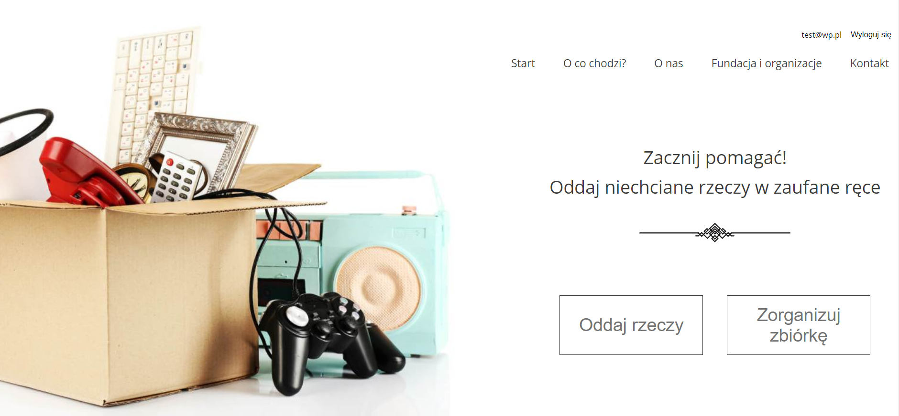
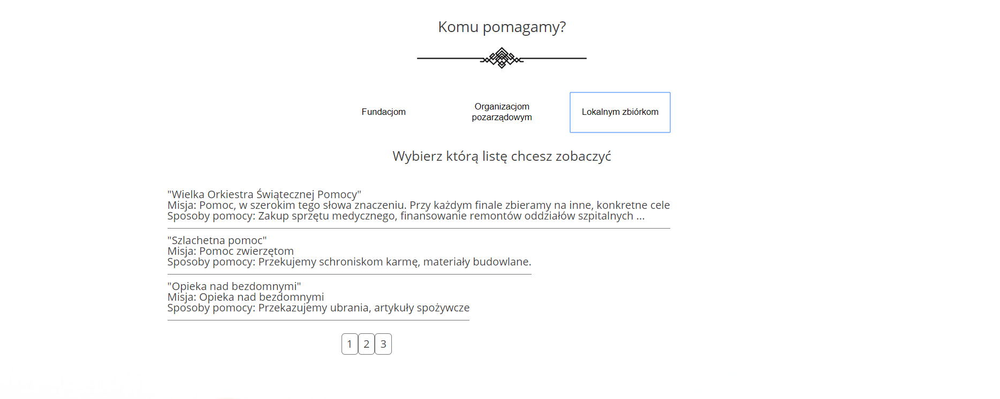
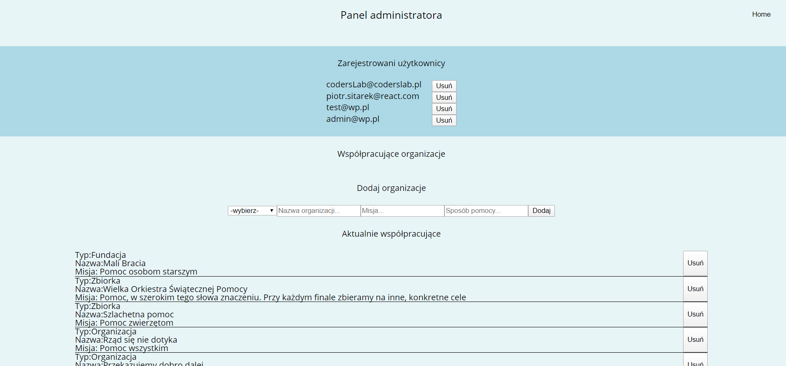

# Info
This aplication is in progress, creating by Piotr Sitarek. 
It is my second application in ReactJS technology. 
Project is available at https://piotrsitarek.pl/Freelance_project/

## Technologies
* HTML5
* Sass
* ReactJS
* JSON Server
* LocalStorage
* Firebase

This project was bootstrapped with [Create React App](https://github.com/facebook/create-react-app).

## Available Scripts

In the project directory, you can run:

### `npm start`

Runs the app in the development mode. 
Open [http://localhost:3000](http://localhost:3000) to view it in the browser.

The page will reload if you make edits. 
You will also see any lint errors in the console.

## Screenshots

